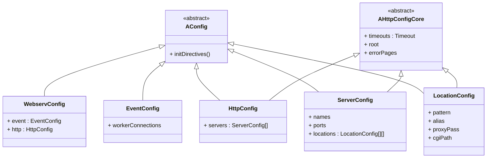

<h1 align="center">
  Webserv
</h1>

<h3 align="center">
  C++ Web server compatible with HTTP 1.1 Protocol.
</h3>

## Key  Features

- HTTP 1.1 프로토콜 지원
- Nginx 설정 파일과 호환
- Kqueue를 통한 I/O Multiplexing
- 정적 파일, CGI 요청 처리

## My Contribution

웹서버의 동작을 정의하는 Nginx 설정 파일 파싱 모듈을 담당했습니다.

- `server` / `location` 블록 등 중첩 구조 구문 분석
- `include` 지시어를 통한 모듈화된 설정 파일 구문 분석
- 파싱된 설정을 기반으로 웹서버가 동작할 수 있도록 계층적 클래스 구조 설계
- 문법 오류 탐지 및 상세 예외 메세지 처리 기능 구현

## Challenges and Solutions

### 1. 파싱 결과의 클래스간 계층 관계 연결

`http`, `server`, `location` 블록의 내부의 지시어들은 대부분 유사하지만 블록에 따라 지원하는 지시어나 문법이 달라져 세세한 부분이 달라져야만 했습니다. 이를 고려하며 코드의 재사용성과 확장성을 고려하는 것에 신경을 썼습니다.

**해결 방법**

- 추상클래스 `AConfig`를 기반으로 하는 계층적 클래스 구조를 설계했습니다.
- 상속을 통해 각 블록에 맞는 공통 로직과 개별 로직을 분리하여 유지보수성을 향상시켰습니다.



**관련 코드**

- [AConfig Header File](./include/Config/AConfig.hpp)
- [AHttpConfigCore Header File](./include/Config/AHttpConfigCore.hpp)

### 2. 재귀적 파싱 구조 설계와 예외 처리

중첩 구조와 모듈화된 설정 파일을 설정 클래스에 저장하기 위해 생성자 내부에서 다른 블록 개체를 재귀적으로 생성해야 했습니다. 이 과정에서 발생하는 문법, 구조 오류, 중복 선언 등 다양한 예외를 적절한 시점에 감지하고 명확하게 에러 메세지로 전달해 웹서버가 오작동하지 않게끔 해야 했습니다.

**해결 방법**

- 파싱 중 발생할 수 있는 문법 오류, 중복 선언, 허용되지 않는 지시어 등을 감지할 수 있도록 상황별 예외 처리 로직을 구축했습니다.
- 예외 발생 시 에러 발생 지점(블록명, 지시어명 등)과 함께 상세 메시지를 제공해 사용자가 원인을 쉽게 파악할 수 있도록 했습니다.
- 상위 블록까지 예외가 전달되어 전체 설정 파일의 구조 오류를 감지할 수 있도록 했습니다.

**관련 코드**

- [ConfigException Header File](./include/Config/ConfigException.hpp)
- [HttpConfig Source File](./src/Config/HttpConfig.cpp)
- [ServerConfig Source File](./src/Config/ServerConfig.cpp)

## Getting Started

### Environment
- Our program uses `kqueue` to implement I/O Multiplexing.
- Therefore, your operating system should compatible with `kqueue`.
- Tested on macOS (Apple silicon and Intel)

### Installation

1. Clone this repo.
``` bash
git clone https://github.com/two-three-four-five/webserv.git
```

2. Compile webserv with Makefile
```bash
make all
```

3. Run
```bash
./webserv [config_file]
```

## Usage

```json
events {
	worker_connections  1024;
}

http {
    include       mime.types;
    default_type  application/octet-stream;

    keepalive_timeout  65;
	client_body_timeout 180;

	server {
		listen 8888;
		server_name localhost;

		client_body_timeout 10;

		location ^ / {
			root   html;
			index  index.html index.htm;
		}
	}
}
```